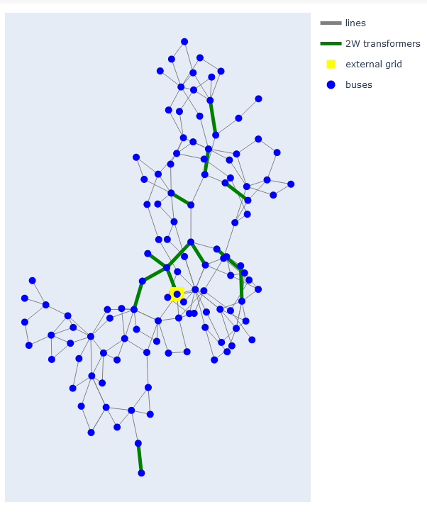

# Final Project -- Network Science for Data Analytics
## Analysis of an Electric Power System using Network Science Notebook

### Group 4 -- Members:
- Daniel Dario Fula
- Manuel Fajardo
- Laura Garzon

## Project Goals
The purpose of this project is to perform an analysis of an electric network using complex network analysis (CNA) techniques to identify key parameters, such as centrality analysis, betweenness centrality, and community detection. The goal is to determine optimal locations for deploying microgrids within electrical distribution systems and identify the most vulnerable nodes or links in the network. These findings will facilitate conducting various tests, such as loss of lines and substations, using simulators like MATPOWER or PandaPower in Python. This work utilizes the IEEE 118 bus test system, as detailed in our dataset and implemented network science approach sections.


### Limitations and Scope
The project’s limitations include the exclusion of analyses such as node embedding or similarity algorithms, which are not justified for the network type and application. Moreover, this analysis is not designed for networks with large numbers of nodes and edges, as their complexity could render the applied methods inapplicable to such systems. The project focuses on analyzing the IEEE 118 bus test system and implementing complex network analysis techniques to identify optimal locations for microgrids and vulnerable network components.




## Instructions for use
### Google Colab
To use this notebook in Google Colab, click on the 'Open in Colab' button. Install the necessary packages by running the following command in a new cell:

```python
!pip install pandapower py4cytoscape
```

### Local Setup with Conda
If you wish to run this notebook on your local machine, you should have [Anaconda](https://www.anaconda.com/download#downloads) installed . After installing Anaconda, follow these steps to create a new Conda environment and install the necessary packages:

1. Open the Anaconda Command Prompt (Windows) or Terminal (Linux/MacOS).

2. Create a new Conda environment with Python 3.10:

```bash
conda create --name network_env python=3.10
```

3. Activate the Conda environment:

```bash
conda activate network_env
```

4. Install the necessary packages:

```bash
conda install -c conda-forge notebook pandas numpy plotly networkx
conda install -c conda-forge pandapower
pip install pandapower
pip install py4cytoscape
```

5. Navigate to the directory that containing the notebook and launch Jupyter Notebook:

```bash
cd /path/to/your/notebook/directory
jupyter notebook
```

This will open a new tab in your web browser where you can select and open the notebook.

_Note_: Replace /path/to/your/notebook/directory with the actual path to your notebook directory.


### Visual Studio Code Setup with Conda

1. Install Visual Studio Code if you haven't done so already. You can download it from [here](https://code.visualstudio.com/download).

2. Launch Visual Studio Code.

3. Open the `.ipynb` notebook file.

4. Once the notebook is open, you will see the Jupyter toolbar at the top. Click on the kernel name in the top-right corner (it may say 'Python 3' or 'Select Kernel').

5. In the kernel selection dialog, click on the button that says "Select Interpreter to start Jupyter server".

6. You will see a list of all available Python environments. Look for and select the Conda virtual environment you created earlier.

7. The notebook should now be using the selected Conda environment. You can confirm this by checking the kernel name on the Jupyter toolbar, which should now match the name of your Conda environment.


## Use the file environment.yml with the libraries

## Installation

To install the required libraries, you'll need to have [Anaconda](https://www.anaconda.com/download#downloads) or [Miniconda](https://docs.conda.io/en/latest/miniconda.html) installed. 

Once you have Anaconda or Miniconda installed, navigate to the project's root directory and run the following command to create a new conda environment with the necessary libraries:

```bash
conda env create -f environment.yml
```

After the new environment is created, activate it with:

```bash
conda activate myenv
```

Now you're ready to run the Jupyter notebook:

```bash
jupyter notebook
```

Or use Visual Studio code [VSCode](#visual-studio-code-setup-with-conda) 

```bash
code .
```


